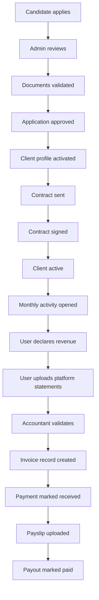
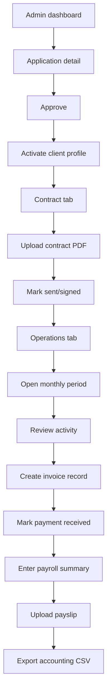

# Driivo Manual-Ops Demo Blueprint

Date: 2026-04-29

## Reframed Goal

The immediate goal is not to build a full legal/accounting/payroll engine.

The goal is to make Driivo feel like a complete portage salarial platform for onboarding and tracking real clients, while the operationally sensitive parts are handled manually by an accountant/admin behind the scenes.

That means the app should become a polished "control tower":

- users see clear post-approval progress,
- admins can move users through operational stages,
- accountants/admins can upload real PDFs and enter manual numbers,
- the platform shows contracts, invoices, expenses, payments, payslips, and monthly activity as tracked records,
- no one expects the software to legally calculate payroll yet.

## Product Principle

Do not fake legal execution. Fake the automation layer.

Good demo fake:
- "Contract generated" means the admin uploaded or selected a PDF and the user sees a contract status.
- "E-signature" means the admin can mark it sent/signed and optionally attach a signed PDF.
- "Payroll" means accountant-entered salary fields plus uploaded payslip PDF.
- "Accounting export" means a downloadable CSV/demo export generated from manually entered records.

Bad fake:
- pretending payroll is legally computed by the app,
- pretending invoices were sent/paid if no admin/accountant has marked them,
- hiding the fact that admin validation is manual.

## Current Starting Point

Driivo already has:

- lead capture,
- application intake,
- user accounts,
- candidate espace,
- document upload/review,
- admin approve/reject/under-review,
- meeting booking,
- email notifications.

The missing demo layer starts after application approval.

## Demo Target: What It Should Feel Like

### For the user

After approval, the user should see a proper operational dashboard:

1. "Bienvenue, votre dossier est approuvé"
2. Contract/signature stage
3. Onboarding checklist
4. Monthly activity declaration
5. Revenue and platform statements
6. Expenses
7. Invoice/payment tracking
8. Payslip and payout history
9. Documents and compliance
10. Support/contact accountant

The user should feel: "I am inside a real Driivo back office."

### For admin/accountant

Admins should be able to:

1. approve a candidate,
2. activate the driver profile,
3. upload or mark contract sent/signed,
4. track onboarding tasks,
5. create monthly periods,
6. enter declared CA manually,
7. upload platform statements,
8. create manual invoice records,
9. mark invoices paid,
10. enter expense decisions,
11. upload payslip PDFs,
12. enter net payout amount,
13. export a monthly accounting CSV,
14. see a timeline of everything.

The accountant handles correctness. The app handles workflow, visibility, and presentation.

## Minimum Demo Modules

### 1. Driver Profile

Purpose:
- Convert approved application into an active client profile.

Fields:
- applicationId
- userId/email
- status: `PENDING_CONTRACT`, `CONTRACT_SENT`, `SIGNED`, `ACTIVE`, `PAUSED`, `OFFBOARDED`
- startDate
- assignedAccountant
- internalNotes

Demo behavior:
- When admin approves an application, show a button: "Activer le dossier client".
- Creates a driver profile and unlocks the post-approval espace.

### 2. Contract Tracker

Purpose:
- Make contract generation/e-signature look complete without implementing a legal document engine yet.

Fields:
- driverProfileId
- status: `DRAFT`, `SENT`, `SIGNED`, `COUNTERSIGNED`
- providerLabel: `Manual`, `Yousign`, `DocuSign`, etc.
- sentAt
- signedAt
- signedPdfFileId

Demo behavior:
- Admin uploads contract PDF or uses a placeholder "Generate demo PDF" action.
- Admin marks "Sent for signature".
- Admin marks "Signed" and uploads signed PDF.
- User sees contract status and can download the PDF.

### 3. Onboarding Checklist

Purpose:
- Show the user/client is being onboarded properly.

Checklist items:
- dossier approved
- identity documents validated
- contract sent
- contract signed
- bank details validated
- accountant assigned
- first activity month opened
- platform statements expected

Demo behavior:
- Admin toggles items.
- User sees clean progress.

### 4. Monthly Activity

Purpose:
- Track actual clients month by month.

Fields:
- driverProfileId
- period: `2026-04`
- status: `OPEN`, `SUBMITTED`, `UNDER_REVIEW`, `VALIDATED`, `CLOSED`
- declaredRevenue
- platformBreakdown JSON: Uber, Bolt, Heetch, FreeNow, other
- notes

Demo behavior:
- User fills a monthly declaration.
- User uploads platform statement PDFs.
- Accountant/admin validates or asks for correction.

### 5. Invoices

Purpose:
- Show billing flow without automated invoicing.

Fields:
- monthlyActivityId
- invoiceNumber
- client/platform
- amountHT
- vatAmount
- amountTTC
- status: `DRAFT`, `SENT`, `PAID`, `OVERDUE`, `CANCELLED`
- invoicePdfFileId
- paidAt

Demo behavior:
- Admin creates manual invoice rows.
- Admin uploads invoice PDF.
- Admin marks sent/paid.
- User sees invoice status timeline.

### 6. Payments

Purpose:
- Show money tracking.

Fields:
- invoiceId
- amount
- receivedAt
- method: bank transfer/manual
- reference
- status: `EXPECTED`, `RECEIVED`, `RECONCILED`

Demo behavior:
- Accountant marks payment received.
- Dashboard updates "CA encaissé".

### 7. Expenses

Purpose:
- Let real clients submit expenses, with accountant validation.

Fields:
- driverProfileId
- period
- category
- amount
- description
- receiptFileId
- status: `SUBMITTED`, `APPROVED`, `REJECTED`, `REIMBURSED`
- reviewNotes

Demo behavior:
- User uploads receipt.
- Admin approves/rejects.
- Approved expenses appear in monthly summary.

### 8. Payroll/Payslip Tracker

Purpose:
- Present payroll outcomes without computing payroll.

Fields:
- driverProfileId
- period
- grossSalary
- netSalary
- managementFee
- socialContributions
- expensesReimbursed
- payoutAmount
- status: `PREPARING`, `READY`, `PAID`
- payslipFileId
- paidAt

Demo behavior:
- Accountant enters final values.
- Accountant uploads payslip PDF.
- User sees "Bulletin disponible" and payout amount.

### 9. Accounting Export

Purpose:
- Give the accountant something useful now.

Demo export:
- monthly CSV with driver, period, declared revenue, invoices, payments, expenses, net payout, status.

This can be simple and still valuable.

### 10. Timeline / Audit-Lite

Purpose:
- Make the platform feel trustworthy and operational.

Events:
- application approved
- contract sent
- contract signed
- document uploaded
- document validated
- monthly activity submitted
- invoice sent
- payment received
- expense approved
- payslip uploaded
- payout marked paid

Demo behavior:
- Append timeline events for major manual actions.
- Show timeline in admin detail and user espace.

## User Flow: Demo Version



## Admin/Accountant Flow: Demo Version



## UI Tabs To Add

### User espace

Replace the current mostly-candidature dashboard with role/state-based sections:

- Overview
- Onboarding
- Contract
- Monthly Activity
- Invoices
- Expenses
- Payslips
- Documents
- Support

For non-approved users, keep the existing candidature tracking view.

For approved/active users, show the post-approval operations dashboard.

### Admin application/client detail

Add tabs:

- Candidature
- Documents
- Contract
- Onboarding
- Monthly Activity
- Invoices & Payments
- Expenses
- Payroll / Payslips
- Timeline
- Notes

## What To Actually Build First

### Sprint 1: Make approval become a client

Build:
- `DriverProfile` table
- activate client action
- user espace switches to client mode when profile exists
- admin detail shows client status
- timeline events

Demo result:
- The platform no longer stops at approval.

### Sprint 2: Contract and onboarding

Build:
- `Contract` table
- upload signed PDF
- manual status changes
- onboarding checklist
- user contract view

Demo result:
- Driivo looks like it handles contract/signature.

### Sprint 3: Monthly activity and expenses

Build:
- `MonthlyActivity` table
- user monthly declaration form
- document uploads tied to monthly activity
- `Expense` table
- admin validation

Demo result:
- Real clients can report monthly work and expenses.

### Sprint 4: Invoices, payments, payslips

Build:
- `Invoice` table
- `Payment` table
- `PayrollSummary` table
- payslip PDF upload
- user financial timeline
- CSV export

Demo result:
- It feels like a complete platform, while accountant still controls the numbers.

## Data Model Proposal

Keep this deliberately simple.

```txt
DriverProfile
- id
- applicationId
- userId
- email
- status
- startDate
- assignedAccountantId
- notes
- createdAt
- updatedAt

Contract
- id
- driverProfileId
- status
- providerLabel
- unsignedFileId
- signedFileId
- sentAt
- signedAt
- createdAt
- updatedAt

OnboardingTask
- id
- driverProfileId
- key
- label
- status
- completedAt
- completedBy

MonthlyActivity
- id
- driverProfileId
- period
- status
- declaredRevenue
- platformBreakdown
- notes
- submittedAt
- validatedAt
- validatedBy

Invoice
- id
- driverProfileId
- monthlyActivityId
- invoiceNumber
- recipient
- amountHT
- vatAmount
- amountTTC
- status
- fileId
- issuedAt
- paidAt

Payment
- id
- invoiceId
- amount
- status
- receivedAt
- reference

Expense
- id
- driverProfileId
- monthlyActivityId
- category
- amount
- description
- receiptFileId
- status
- reviewNotes
- reviewedAt
- reviewedBy

PayrollSummary
- id
- driverProfileId
- monthlyActivityId
- grossSalary
- netSalary
- managementFee
- socialContributions
- expensesReimbursed
- payoutAmount
- status
- payslipFileId
- paidAt

TimelineEvent
- id
- actorId
- driverProfileId
- applicationId
- type
- title
- description
- metadata
- createdAt
```

## Demo Seed Data

Add realistic demo cases:

1. Active client, contract signed, April activity open.
2. Active client, invoice sent, payment pending.
3. Active client, payment received, payslip ready.
4. Client with rejected expense.
5. Client missing platform statement.
6. New approved candidate waiting for contract.

This will make the admin dashboard feel alive.

## What The Accountant Does For Now

The accountant remains the source of truth for:

- salary calculations,
- payroll validation,
- payslip production,
- tax/social contribution treatment,
- accounting classification,
- invoice correctness,
- payment reconciliation.

Driivo app does:

- collect inputs,
- store documents,
- show statuses,
- expose a client portal,
- centralize files,
- create simple exports,
- make the operation look organized.

This is the correct short-term split.

## Risk Boundaries

Keep these labels clear in the product:

- Use "Synthèse de paie" instead of "Paie calculée automatiquement".
- Use "Montant renseigné par l'équipe Driivo" where relevant.
- Use "Bulletin importé" not "Bulletin généré" until generation is real.
- Use "Facture ajoutée" or "Facture préparée" if invoices are uploaded manually.

This keeps the demo credible without overclaiming.

## Final Recommendation

Build a manual-ops layer, not a fake payroll engine.

The app should look end-to-end because every module exists in the user/admin journey, but the sensitive financial/legal outputs should be manually entered or uploaded by the accountant.

This is enough to:

- onboard actual clients,
- track real progress,
- centralize documents,
- make demos feel complete,
- avoid premature payroll complexity,
- keep humans in control where legal/accounting accuracy matters.
