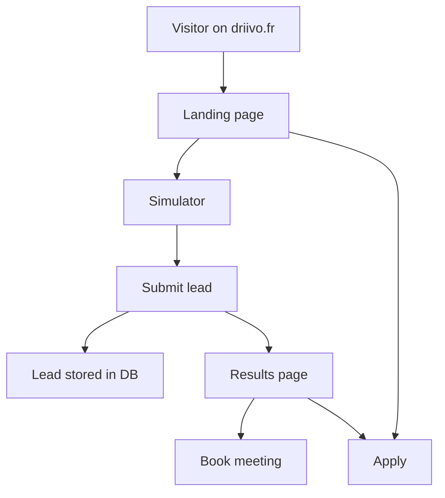
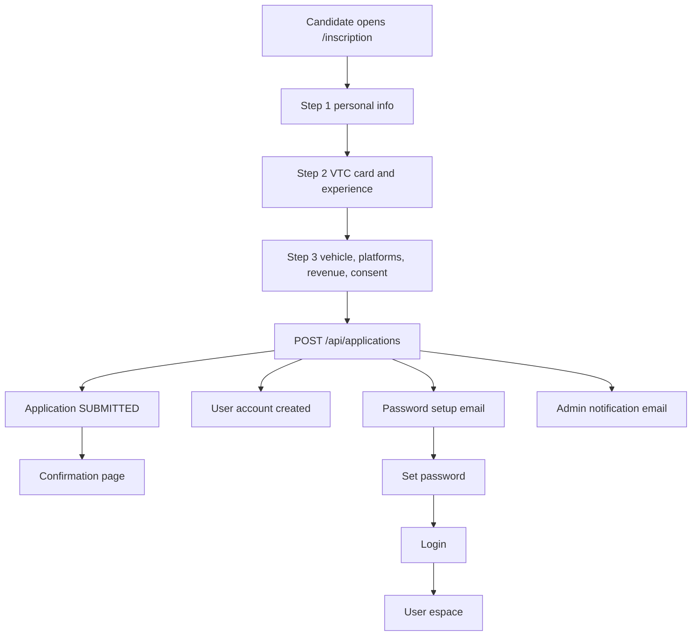
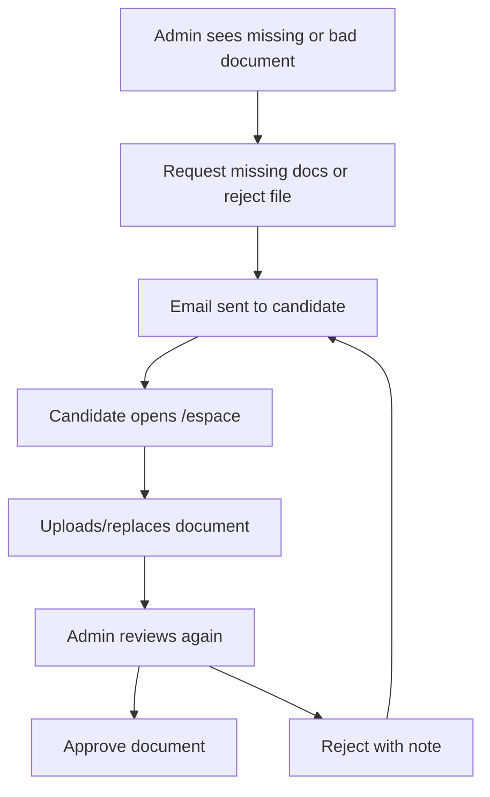

# Driivo Platform Audit: User Flow, Admin Flow, and Portage Salarial Readiness

Date: 2026-04-29
Scope: current repository at `/home/rick/Documents/websites/driivo`, with the active product in `loop/`.

## Executive Verdict

Driivo is not yet a complete end-to-end portage salarial platform.

It is currently a solid lead capture, candidate onboarding, document collection, and admin selection platform for VTC drivers. It can attract users, collect applications, create user accounts, let users upload documents, let admins review candidates, and approve or reject applications.

It does not yet run the full portage salarial operating lifecycle after approval: contract generation and e-signature, client or mission management, invoice generation, payment tracking, monthly activity declarations, expense handling, payroll production, payslip storage, accounting exports, audit logs, or compliance workflows.

The platform can select users. It cannot yet operate them end to end once selected.

## Source Evidence

Key files audited:

- `loop/src/routes/index.tsx`: landing page and app-domain login switch.
- `loop/src/routes/simulateur.tsx`: simulator and lead capture.
- `loop/src/routes/resultats.tsx`: simulator result page.
- `loop/src/routes/inscription.tsx`: 3-step application form.
- `loop/src/routes/confirmation.tsx`: post-application confirmation.
- `loop/src/routes/set-password.tsx`: password setup.
- `loop/src/routes/espace.tsx`: user dashboard and document upload.
- `loop/src/routes/reunion.tsx`: meeting booking.
- `loop/src/routes/admin/index.tsx`: admin dashboard.
- `loop/src/routes/admin/applications.$id.tsx`: admin application detail and document review.
- `loop/src/routes/api/applications.ts`: application CRUD/status API.
- `loop/src/routes/api/leads.ts`: lead capture and admin lead status API.
- `loop/src/routes/api/meetings.ts`: meeting booking and status API.
- `loop/src/routes/api/files.ts`: authenticated file upload/download/review/delete API.
- `loop/src/routes/api/document-requests.ts`: admin document request email flow.
- `loop/src/lib/db/schema/loop.schema.ts`: core schema.
- `loop/src/lib/documents.ts`: document categories and completion logic.
- `loop/src/lib/server/email.ts`: Resend email templates.
- `loop/src/lib/auth/auth.ts`: Better Auth configuration.

Runtime verification note: `node`, `npm`, and `pnpm` are not available in this shell, so I could not run `npm run check-types`, `npm run build`, or a local browser test. This report is source-code based.

## Current Platform Modules

### 1. Public acquisition site

Purpose:
- Sell the value proposition: VTC independence plus CDI-like security.
- Drive prospects toward simulation, booking, and application.

Implemented:
- Landing page.
- Salary simulator CTA.
- Application CTA.
- Login link to app domain.

Evidence:
- Root route chooses landing or login based on host in `loop/src/routes/index.tsx`.
- Marketing copy promotes "entrepreneur salarie VTC", payslip, unemployment, retirement, and mutual coverage.

Assessment:
- Good acquisition surface.
- Mostly marketing and funnel oriented, not operational portage yet.

### 2. Simulator and lead capture

Purpose:
- Let prospects estimate net income.
- Capture lead contact details.
- Store lead for admin follow-up.

Implemented:
- CA slider.
- Driivo, auto-entrepreneur, and SASU comparison.
- Lead POST to `/api/leads`.
- Lead deduplication by email.
- Lead status tracking by admin.

Evidence:
- Simulator submits lead data in `loop/src/routes/simulateur.tsx:99`.
- Lead API stores monthly revenue, estimated net, source, UTM fields, and status in `loop/src/routes/api/leads.ts:13`.
- Lead schema includes statuses `NEW`, `CONTACTED`, `QUALIFIED`, `CONVERTED`, `LOST` in `loop/src/lib/db/schema/loop.schema.ts:29`.

Assessment:
- Good top-of-funnel CRM-lite system.
- No real CRM automation, no lead-to-application conversion workflow, no reminders, no assignment, no sales pipeline beyond status buttons.

### 3. Candidate application

Purpose:
- Collect enough data to select whether a VTC driver should join Driivo.

Implemented:
- 3-step public form:
  - personal info
  - VTC card and experience
  - vehicle, platforms, revenue, consent
- Server-side create endpoint.
- Duplicate active application protection by email.
- Auto user account creation.
- Password setup email.
- Candidate and admin email notifications.

Evidence:
- Form state and validation are in `loop/src/routes/inscription.tsx:20`.
- Submission maps the form into API fields in `loop/src/routes/inscription.tsx:95`.
- API prevents duplicate non-rejected applications in `loop/src/routes/api/applications.ts:32`.
- API inserts `SUBMITTED` application rows in `loop/src/routes/api/applications.ts:65`.
- API creates auth account and password reset flow in `loop/src/routes/api/applications.ts:87`.

Assessment:
- Strong basic candidate intake.
- Not yet a complete portage onboarding dossier. Missing structured identity/KYC validation, signed terms, contract variables, bank verification, legal acceptance proof, and formal onboarding milestones.
- Schema expects a 6-step application and structure fields, but the UI is only 3 steps. `totalSteps` defaults to 6 in `loop/src/lib/db/schema/loop.schema.ts:141`, while the form says 3 steps in `loop/src/routes/inscription.tsx:142`.
- `structureType` exists in the DB but is not collected by the current public form.

### 4. User account and user espace

Purpose:
- Give accepted or pending candidates a private place to track their dossier.

Implemented:
- Auth-gated `/espace`.
- Fetches latest application for the authenticated email.
- Fetches user meetings.
- Fetches and uploads documents.
- Shows application status.
- Shows progress checklist.
- Shows required documents and review status.
- Provides support mailto and meeting booking link.

Evidence:
- `/espace` requires auth in `loop/src/routes/espace.tsx:30`.
- Fetches application in `loop/src/routes/espace.tsx:90`.
- Fetches files in `loop/src/routes/espace.tsx:105`.
- Fetches meetings in `loop/src/routes/espace.tsx:115`.
- Uploads application documents in `loop/src/routes/espace.tsx:125`.
- Shows statuses `APPROVED`, `REJECTED`, `UNDER_REVIEW`, and default pending in `loop/src/routes/espace.tsx:213`.
- Progress checklist includes application sent, review, required docs, phone call, and final validation in `loop/src/routes/espace.tsx:501`.

Assessment:
- This is the start of a proper candidate portal.
- It stops at onboarding and selection. There is no post-approval operating dashboard for revenue, invoices, payslips, expenses, contracts, activity reports, or payroll.

### 5. Document collection and review

Purpose:
- Collect required documents for Driivo to validate the driver.

Implemented:
- Required documents:
  - identity
  - driving license
  - VTC card
  - RIB
  - proof of address
  - vehicle registration
  - vehicle insurance
- Optional documents:
  - platform statement
  - URSSAF or status document
  - other
- Authenticated upload.
- R2/S3-compatible storage.
- File metadata table.
- Admin document approve/reject.
- Admin can request missing documents.
- User sees rejected notes and can replace files.

Evidence:
- Document categories in `loop/src/lib/documents.ts:1`.
- Completion calculation in `loop/src/lib/documents.ts:122`.
- File storage metadata in `loop/src/lib/db/schema/loop.schema.ts:204`.
- Upload access checks in `loop/src/routes/api/files.ts:42`.
- Upload validation and R2 upload in `loop/src/routes/api/files.ts:75`.
- Admin file review in `loop/src/routes/api/files.ts:285`.
- Document review emails in `loop/src/lib/server/email.ts:277`.
- Admin request missing documents in `loop/src/routes/admin/applications.$id.tsx:258`.

Assessment:
- This is one of the strongest parts of the current platform.
- Still missing audit trail, document expiry dates, version history, automatic completeness gating before approval, OCR/KYC checks, and legal retention policy.

### 6. Meeting booking

Purpose:
- Let candidates book a call.

Implemented:
- Custom booking UI.
- Availability endpoint.
- Slot conflict prevention.
- Admin can update meeting status.
- User can see scheduled meetings.
- Confirmation email.

Evidence:
- Booking API with slot conflict prevention in `loop/src/routes/api/meetings.ts:39`.
- Availability mode in `loop/src/routes/api/meetings.ts:105`.
- Admin meeting status update in `loop/src/routes/api/meetings.ts:172`.
- Admin meeting UI in `loop/src/routes/admin/index.tsx:503`.

Assessment:
- Works as a simple scheduling system.
- Not integrated with Google Calendar, Cal.com, conferencing links, reminders, rescheduling, cancellation rules, or internal advisor assignment.

### 7. Admin selection workflow

Purpose:
- Let admins select, reject, or investigate candidates.

Implemented:
- Admin-only dashboard.
- Global stats.
- Search.
- Sections for applications, leads, and meetings.
- Application list with status filters.
- Lead status buttons.
- Meeting status buttons.
- Application detail page.
- Completeness score.
- Personal, activity, vehicle, and document sections.
- Internal notes.
- Approve, reject, and under-review status actions.
- Candidate email notifications on status changes.

Evidence:
- Admin route guard in `loop/src/routes/admin/index.tsx:23`.
- Dashboard fetches applications, leads, and meetings in `loop/src/routes/admin/index.tsx:103`.
- App stats in `loop/src/routes/admin/index.tsx:188`.
- Admin sections in `loop/src/routes/admin/index.tsx:308`.
- Application list and filters in `loop/src/routes/admin/index.tsx:336`.
- Leads table and status update actions in `loop/src/routes/admin/index.tsx:421`.
- Meetings table and status update actions in `loop/src/routes/admin/index.tsx:503`.
- Application detail route guard in `loop/src/routes/admin/applications.$id.tsx:52`.
- Status update actions in `loop/src/routes/admin/applications.$id.tsx:302`.
- Backend status patch and email notification in `loop/src/routes/api/applications.ts:179`.

Assessment:
- Yes, admins can select users.
- The selection is manual and lightly structured. There is no eligibility rules engine, reviewer checklist, second approval, rejection reason taxonomy, audit log, SLA, risk scoring, or mandatory document completion gate before approval.

## Flow Maps

### Anonymous prospect flow



Operational notes:
- Lead capture can happen before application.
- Results page pushes users either to booking or application.
- Lead and application are not formally linked unless the meeting has a `leadId`; the application create flow does not attach a prior lead.

### Candidate application flow



Current risk:
- The frontend requires consent, but the server schema makes `consentAccepted` optional and defaults it to false. A direct API caller can submit without consent.

### User espace flow

```mermaid
flowchart TD
  A[Authenticated user] --> B[/espace]
  B --> C[Fetch own applications by email]
  B --> D[Fetch own meetings]
  C --> E[Latest application shown]
  E --> F[Status banner]
  E --> G[Progress checklist]
  E --> H[Documents tab]
  H --> I[Upload required document]
  I --> J[File stored in R2 plus metadata]
  J --> K[Admin reviews document]
  K --> L[Approved]
  K --> M[Rejected with note]
  M --> H
```

Current limitation:
- After approval, the user still sees only candidature status and document workflow. There is no live portage operating space.

### Admin dashboard flow

```mermaid
flowchart TD
  A[Admin login] --> B[/admin]
  B --> C[Stats]
  B --> D[Applications]
  B --> E[Leads]
  B --> F[Meetings]
  D --> G[Application detail]
  G --> H[Review profile]
  G --> I[Review documents]
  G --> J[Request missing docs]
  G --> K[Internal notes]
  G --> L[Approve]
  G --> M[Reject]
  G --> N[Set under review]
  L --> O[Status email]
  M --> O
  N --> O
```

Current limitation:
- Admin approval is not tied to a contract, payroll setup, account activation checklist, or post-selection workflow.

### Document correction loop



This loop is useful and close to production-grade for candidate dossier collection.

## Current Data Model

### Lead

Stores:
- identity/contact
- monthly revenue
- estimated net
- source and UTM
- lead status
- notes and last contact date

Use today:
- Lead capture and admin follow-up.

Missing for full platform:
- ownership/assignee
- lead timeline
- call history
- conversion link to application
- follow-up tasks

### Application

Stores:
- application status
- activity type
- structure fields
- personal info
- VTC experience
- vehicle info
- revenue target
- flexible JSON formData
- review metadata
- admin notes

Use today:
- Candidate selection.

Missing for full platform:
- signed contract state
- onboarding checklist state
- legal consent versions
- payroll profile
- bank verification status
- contract start date and end date
- portage agreement references
- termination/suspension states
- detailed reviewer history

### MeetingBooking

Stores:
- candidate contact
- scheduled date
- time slot
- duration
- status
- optional lead link

Use today:
- Simple qualification call scheduling.

Missing for full platform:
- calendar provider event ID
- meeting URL
- advisor assignment
- reminder state
- reschedule/cancel self-service
- meeting outcome

### StoredFile

Stores:
- object key
- original name
- MIME type
- size
- entity type and entity ID
- uploader
- document category
- review status
- review notes

Use today:
- Candidate dossier document storage and review.

Missing for full platform:
- hard foreign keys to application/document entities
- document expiry date
- version chain
- immutable audit trail
- retention policy
- antivirus or malware scan result
- KYC/OCR extraction results

### Auth

Implemented:
- Better Auth.
- Email/password.
- Admin plugin.
- Roles: `USER`, `ADMIN`.
- 7-day sessions.
- auth rate limits.

Missing for full platform:
- role granularity such as sales, reviewer, payroll, accounting, support.
- MFA for admin users.
- action-level permissions.
- admin impersonation policy/audit.

## Portage Salarial Readiness Matrix

| Capability | Current status | Is it enough for real end-to-end portage? |
|---|---:|---|
| Landing and acquisition | Implemented | Yes for acquisition |
| Salary simulation | Implemented but simplified | No, not payroll-grade |
| Lead capture | Implemented | Partial |
| Candidate application | Implemented | Partial |
| Admin selection | Implemented | Partial, manual only |
| User account | Implemented | Partial |
| User document upload | Implemented | Good foundation |
| Admin document review | Implemented | Good foundation |
| Meeting booking | Implemented | Partial |
| Email notifications | Implemented | Partial, no delivery tracking |
| Contract generation | Missing | No |
| E-signature | Missing | No |
| Mission/client management | Missing | No |
| Activity declarations | Missing | No |
| Platform revenue import | Missing | No |
| Invoice generation | Missing | No |
| Payment tracking | Missing | No |
| Expense management | Missing | No |
| Payroll calculation | Missing | No |
| Payslip generation/storage | Missing | No |
| Mutual/benefit enrollment | Missing | No |
| Accounting exports | Missing | No |
| Compliance/audit log | Missing | No |
| Support/tickets | Missing, mailto only | No |
| Multi-admin permissions | Missing | No |

## What "End-to-End Portage Salarial" Should Mean Here

For a real portage salarial platform, the lifecycle should be:

1. Acquisition
2. Lead qualification
3. Candidate application
4. Document/KYC collection
5. Admin selection
6. Contract generation
7. E-signature
8. Account activation
9. Mission/client/platform setup
10. Monthly CA or activity declaration
11. Invoice generation and dispatch
12. Payment collection and reconciliation
13. Expense submission and validation
14. Payroll calculation
15. Payslip generation
16. User payout tracking
17. Ongoing compliance and document renewals
18. Support and issue handling
19. Termination/offboarding

Driivo currently covers steps 1 through 5 well enough for an MVP, partially covers step 6 only as text in emails/confirmation copy, and does not implement steps 7 through 19.

## Can Admins "Select Users" Today?

Yes, but only at the application status level.

Current selection actions:
- `APPROVED`
- `REJECTED`
- `UNDER_REVIEW`

What works:
- Admin can view candidate profile.
- Admin can inspect uploaded documents.
- Admin can ask for missing documents.
- Admin can validate or reject documents.
- Admin can write notes.
- Admin can approve/reject the candidature.
- Candidate receives status emails if email is configured.

What is missing:
- Required approval checklist.
- Mandatory document-complete gate before approval.
- Legal reason codes for rejection.
- Internal reviewer assignment.
- Dual-control review for risky cases.
- Immutable admin action log.
- Decision history.
- Approved-user activation workflow.

## Main Product Gaps

### Gap 1: Approval does not activate a real portage account

Today, `APPROVED` changes the application status and sends an email. It does not create a contract, payroll profile, mission, or operational workspace.

Recommended target:
- Add an `onboarding_stage` or dedicated onboarding table.
- Use stages such as `APPROVED`, `CONTRACT_PENDING`, `SIGNED`, `PAYROLL_SETUP`, `ACTIVE`, `SUSPENDED`, `OFFBOARDED`.

### Gap 2: No contract module

Missing:
- contract templates
- variable merge
- company/legal entity info
- candidate signature status
- Driivo countersignature
- PDF storage
- e-sign provider webhook

Recommended tables:
- `contractTemplate`
- `contract`
- `contractSignatureEvent`

### Gap 3: No mission, client, or platform revenue module

For VTC, the platform likely needs to handle activity coming from Uber/Bolt/Heetch/FreeNow or client invoices.

Missing:
- connected platforms
- monthly revenue declarations
- uploaded platform statements as structured data
- mission/client account
- revenue validation workflow

Recommended tables:
- `driverProfile`
- `connectedPlatform`
- `monthlyActivity`
- `activityLine`
- `revenueDocument`

### Gap 4: No invoicing and payment tracking

Missing:
- invoice creation
- invoice numbers
- tax/VAT treatment
- payment due dates
- paid/unpaid status
- payment reconciliation
- failed payment handling

Recommended tables:
- `invoice`
- `invoiceLine`
- `payment`
- `paymentAllocation`

### Gap 5: No payroll engine or payroll integration

The current salary simulator uses simple assumptions: 10 percent Driivo fee, 14 percent cotisations, and 76 percent net. That is useful for marketing, not payroll.

Missing:
- gross salary
- employer contributions
- employee contributions
- net before/after tax
- paid leave reserve
- management fees
- social contributions
- expense reimbursement
- payslip generation
- export to payroll provider

Recommended approach:
- Do not hand-roll legal payroll logic unless Driivo has payroll experts validating every rule.
- Integrate a payroll provider or accounting/payroll workflow, then store the outputs and status.

### Gap 6: No expense workflow

Missing:
- upload receipts
- categorize expenses
- validate/reject expenses
- reimburse or deduct
- link expenses to payroll period

Recommended tables:
- `expense`
- `expenseAttachment`
- `expenseReview`

### Gap 7: No audit trail

Important admin actions mutate state without an immutable audit log.

Missing audit events:
- status changed
- notes changed
- document approved/rejected/deleted
- missing documents requested
- lead status changed
- meeting status changed
- contract sent/signed
- payroll generated
- invoice paid

Recommended table:
- `auditEvent` with actor ID, target type, target ID, action, previous value, next value, timestamp, and request metadata.

### Gap 8: Emails are useful but not operationally reliable

Current email functions are fire-and-forget in some flows, and if `RESEND_API_KEY` is missing the system logs and skips.

Missing:
- email queue
- retry logic
- delivery status
- bounce handling
- template versioning
- event log visible to admin

### Gap 9: Consent is frontend-only in practice

The inscription UI blocks submit without consent, but the API allows `consentAccepted` to default to false.

Recommended fix:
- Require `consentAccepted: true` server-side for public applications.
- Store consent text version and IP/user-agent.

### Gap 10: Roles are too broad

Today there are effectively user and admin roles.

Recommended roles:
- super admin
- sales/admin reviewer
- document reviewer
- payroll manager
- accountant
- support
- user

## Suggested End-to-End Target Architecture

### Core domains

1. CRM
   - leads
   - follow-ups
   - conversion to application

2. Onboarding
   - application
   - documents
   - checks
   - approval
   - contract

3. Driver operations
   - driver profile
   - platforms
   - monthly activity
   - revenue imports
   - expenses

4. Finance
   - invoices
   - payments
   - reconciliation
   - payroll periods
   - payslips

5. Compliance
   - audit events
   - document expiry
   - legal consents
   - contract versions

6. Communication
   - email queue
   - templates
   - support tickets
   - notification log

## Recommended Roadmap

### Phase 0: Harden current MVP

Priority:
- Restore local Node/npm availability and run typecheck/build.
- Enforce consent server-side.
- Add admin audit events for every PATCH/DELETE.
- Add document-complete gating warning before approval.
- Add email event logging.
- Add lead-to-application linking by email or explicit relationship.
- Add meeting outcome notes.

### Phase 1: Make selection operational

Build:
- structured eligibility checklist
- reviewer assignment
- rejection reasons
- application timeline
- application comments
- onboarding stages after approval

Goal:
- Admin can clearly decide who is eligible and why.

### Phase 2: Add contract and activation

Build:
- contract template data model
- generated contract PDF
- e-sign integration
- signature webhooks
- active driver profile after signature

Goal:
- Approval becomes a legally meaningful activation process.

### Phase 3: Add monthly operations

Build:
- driver dashboard after approval
- monthly activity declaration
- platform revenue upload/import
- expense submission
- admin validation

Goal:
- Users can operate month to month inside Driivo.

### Phase 4: Add finance and payroll

Build:
- invoice model
- payment tracking
- payroll period model
- payroll provider export/import
- payslip storage
- payout status

Goal:
- Driivo can manage money flows, not just onboarding.

### Phase 5: Add compliance and scale

Build:
- audit logs
- document expiry monitoring
- compliance reminders
- advanced roles
- reporting exports
- customer support/ticketing

Goal:
- Platform is ready for real operations and team scale.

## Current Score

| Area | Score | Comment |
|---|---:|---|
| Acquisition funnel | 8/10 | Strong landing, simulator, application CTA |
| Candidate onboarding | 7/10 | Good MVP, still only 3 steps and not legal-grade |
| Document collection | 8/10 | Strong foundation with R2 and review statuses |
| Admin selection | 7/10 | Works, but manual and unaudited |
| User espace | 5/10 | Good for candidature tracking, not post-approval operations |
| Portage operations | 1/10 | Mostly missing |
| Finance/payroll | 0/10 | Not implemented |
| Compliance/audit | 2/10 | Basic auth and document statuses, no audit system |
| Overall as onboarding MVP | 7/10 | Usable candidate selection platform |
| Overall as end-to-end portage platform | 3/10 | Not there yet |

## Bottom Line

If your question is "Can Driivo capture and select users today?", the answer is yes.

If your question is "Is this already a full portage salarial platform end to end?", the answer is no.

The current platform is best described as:

> A Driivo acquisition, candidature, document review, meeting, and admin selection platform for VTC drivers.

The target platform should become:

> A full portage salarial operating system covering lead capture, selection, contract, e-signature, mission/activity, invoicing, payments, expenses, payroll, payslips, compliance, support, and offboarding.

The next decisive build step is not more marketing UI. It is the transition from "approved candidate" to "active portage user": contract, activation, monthly activity, finance, and payroll.
